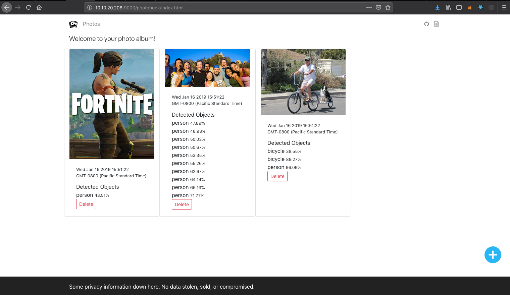
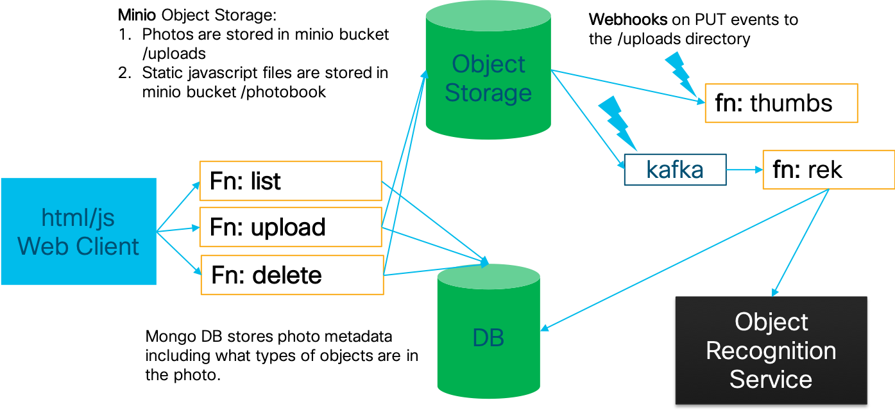

# On Prem Serverless

[Serverless Architectures](https://www.martinfowler.com/articles/serverless.html) are becoming quite popular with developers.  They allow you to write less code and do rapid prototypes faster.  

You usually hear about serverless in the public clouds such as AWS, Google, and Microsoft.  But thanks to Kubernetes we can also run serverless on prem using the [serverless framework](https://serverless.com) with several different kubernetes serverless integrations.  

In this tectorial we will create a photobook application from the ground up that uses serverless frameworks on top of Kubernetes.  

The photobook will also incorporate an object recognition service and tag objects in the photo.  All of these components can be entirely done on-prem and do not use any external services.  Our end goal will be to build the components in the architecture below.  All of this will be built on Kubernetes.

Below are the contents of the two sections in our course.  You can refer back to this page to view your progression through this wonderful world of serverless!

## Part I: Building the Platform

* [1. DEVNET Sandbox](sb/README.md)
* [2. CCP Kubernetes](kubernetes/README.md)
* [3. Helm](helm/README.md)
* [4. MongoDB](mongo/README.md)
* [5. Minio](minio/README.md)
* [6. Kubeless](kubeless/README.md)

## Part II: Building the Application 

* [7. Application Overview](photos/OVERVIEW.md)
* [8. Serverless](serverless/README.md)
* [9. NodeJS Frontend](photos/README.md)
* [10. Object Recognition](yolo/README.md)

## Credits and Shoutouts

Much of the work here is based off the [FONK](https://fonk-apps.io) idea that [Pete Johnson](https://twitter.com/nerdguru) has been developing.  

[Julio Gomez](https://twitter.com/juliodevops) also has made large contributions by speaking and adding code to this terrific movement. 

Without great projects like [Minio](https://minio.io), [Kubeless](https://kubeless.io), and [Serverless](https://serverless.com) much of this would not be possible. 

We are hopeful that as we go forward more people find the ideas of serverless bring great promise to on prem workloads and are not limited to public clouds only.

Serverless is still very much in its infancy and more tools and better techniques are still needed to make the experience better.   

