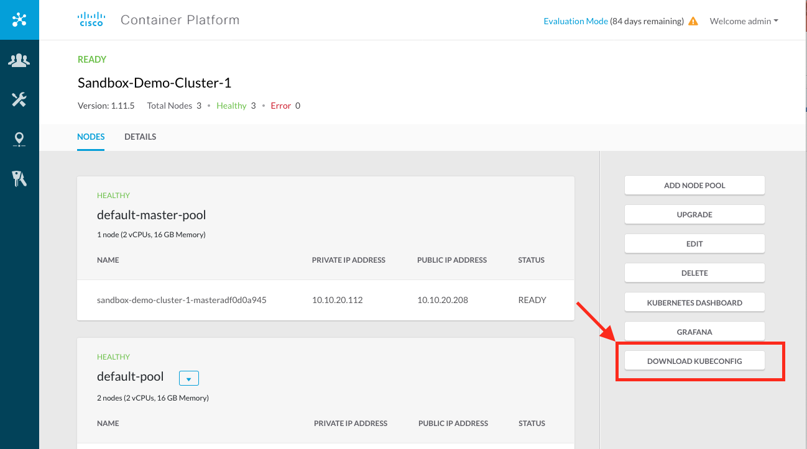

# 2. CCP Kubernetes

Cisco Container Platform provides an environment where we are able to launch kubernetes clusters and manage the lifecyle of the clusters including easy updates and migrations. 

In this module we will show some kubernetes commands we will be using to navigate around our cluster. 

## 2.1 Get `kubectl`

Kubernetes is managed through the command line with the [`kubectl`](https://kubernetes.io/docs/tasks/tools/install-kubectl/) command. Pronounced _kube control_ or _kube cuddle_ by those who feel more pleasure from it.

In order to do the exercises in this course you will need to have this installed on your machine.  Fortunately, its pretty easy.  Please take time to look at the official [Kubernetes Documentation](https://kubernetes.io/docs/tasks/tools/install-kubectl/) and install `kubectl`.

For quick installations (no package manager system) you can simply download the binaries using the below instructions.  

### 2.1.1 Windows

1. [Download Binary](
https://storage.googleapis.com/kubernetes-release/release/v1.13.0/bin/windows/amd64/kubectl.exe)
2. Put the binary in your path. 

### 2.1.2 MacOS

Download with curl:

```
curl -LO https://storage.googleapis.com/kubernetes-release/release/$(curl -s https://storage.googleapis.com/kubernetes-release/release/stable.txt)/bin/darwin/amd64/kubectl
chmod +x ./kubectl
mv ./kubectl /usr/local/bin/
```

### 2.1.3 Test Kubectl

To make sure it works run: 

```
kubectl version
```

You may see an error about `localhost:8080 was refused`, that's ok, you are still a good person. The important thing is that you get output and that it is in your path.  

## 2.2 Kubernetes Credentials

In the [previous module](../sb/README.md) you opened a web page to CCP.  On this page there is a preconfigured Kubernetes cluster for you.  While you can create new clusters if you want, we will use this Kubernetes cluster for our system.  It is called `Sandbox-Demo-Cluster-1`.  Click on the cluster and you will come to a page that shows details of the cluster.  Download the kubeconfig file




## Where to next?

* [Home](../README.md)
* [Previous: Cisco Sandbox](../sb/README)
* [Next Module: What the Helm?](../helm/README.md)