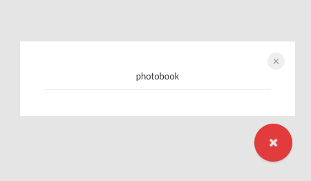
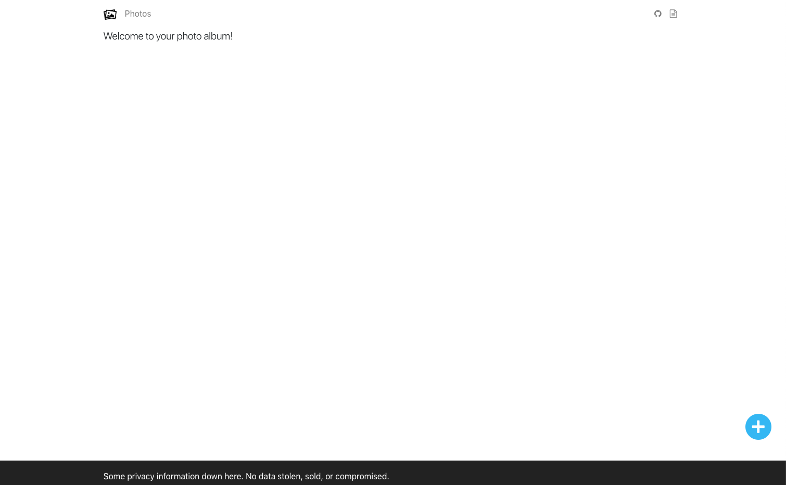

# Photos

This is the front end of our application.  This front end was bootstrapped with [Create React App](https://github.com/facebook/create-react-app).  We will store this in minio. 


## Deployment

### Setup Minio

#### Option A: GUI Method
Log in to minio and click on the big red + sign to create a bucket named `photobook`.  Once it is created, hover over the bucket name in the left side bar to reveal three vertical dots:

This will give you three different js files.  Put them all in the `photobook` button. 



Once created click on the three verticle dots to edit the policy. Create a __Read Only__ policy for every file by using the __*__.   


#### Option B: Command Line

```
mc mb minio/photobook
mc policy -r download minio/photobook
```

### Get Ingress information

First let's get the IP address of the ingress controller:

```
kubectl -n ccp get svc nginx-ingress-controller -o jsonpath='{.status.loadBalancer.ingress[0].ip}
```
This should give you out an IP address such as `10.10.20.207`.  Make note of this IP address.  

We will use the [xip](http://xip.io/) service and a Kubernetes ingress rule so that if we point our browsers to [https://minio.10.10.20.207.xip.io](https://minio.10.10.20.207.xip.io) then it will go straight to minio. 


### Configure the Webpage

We need to set the API to the endpoint we set up with our kubeless functions in the serverless section.  Remember we are using the ingress controller to access our functions, so that is the IP address we put in.  If we run: 
```
kubectl describe ing photos
```
Then we see an ingress rule for each of our services.  The `Host` entry is set to something like `10.93.140.128.xip.io`.  This is our API endpoint.  We enter this into our file:

```
vi src/services/photos.js
```
At the top of the file change the API variable to yours:

```diff
- export const API = "http://10.93.140.128.xip.io"
+ export const API = "http://<your-IP>.xip.io"
```

### Compile the WebPage

In the `photos` directory build with npm:

```
npm run build
```
This will create all the resources we need in the `build` directory.

### Upload the static web assets

We will copy everything to the `photobook` directory using the minio `mc` command line tool: 

```
mc cp --recursive build/ minio/photobook/
```

if you have the browser open you should then see all the elements in the minio browser by refreshing


Or you can run `mc ls minio/photobook`

```
mc ls minio/photobook
[2019-01-11 13:25:19 PST]   577B asset-manifest.json
[2019-01-11 13:25:20 PST] 2.6KiB index.html
[2019-01-11 13:25:20 PST]   402B precache-manifest.b801a63cc481b5e3254d09b88e8d797d.js
[2019-01-11 13:25:20 PST] 1.0KiB service-worker.js
[2019-01-11 13:40:55 PST]     0B css/
[2019-01-11 13:40:55 PST]     0B fonts/
[2019-01-11 13:40:55 PST]     0B images/
[2019-01-11 13:40:55 PST]     0B static/
```

### Access the Static Web Contents

Using the minio URL you should now be able to access the web site.  Note that you don't put `minio` in the url:

e.g: 
```
http://10.93.140.130:9000/photobook/index.html
```
not 
```
http://10.93.140.130:9000/minio/photobook/index.html
```

The webpage should then be visible: 



## Development

Perhaps there are changes you would like to make to the code? To do that we can run the code locally and make changes.  React has a nice way of rendering and making changes as we change files. 

```
npm start 
```

