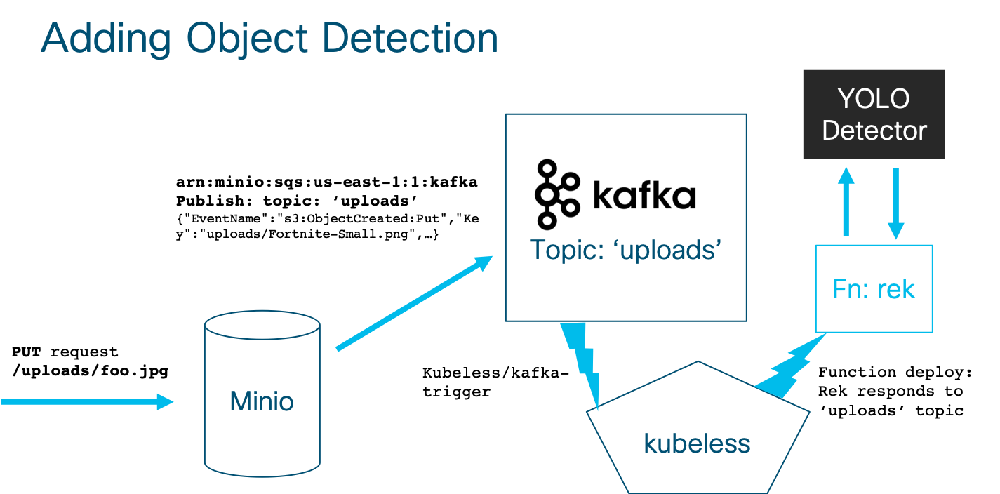
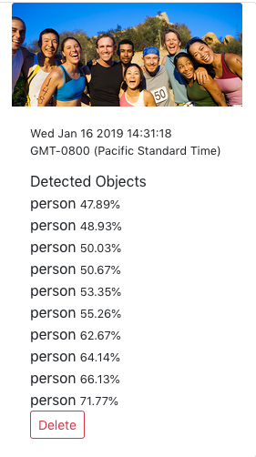

# 10. Object Recognition

Object Recognition in photos has made many advances in the last several years.  The advances have come from more data, better algorithms, and mountains of cheap computing power. 

## 10.1 Introducing YOLO

[YOLO](https://pjreddie.com/darknet/yolo/) is a real time object detection algorithm with a [flexible license](https://github.com/pjreddie/darknet/blob/master/LICENSE.fuck).  Like many machine learning algorithms it is open source and we are able to use it in many different applications free of charge. 


(source: [YOLO homepage](https://pjreddie.com/darknet/yolo/))

We will take an implementation of this algorithm that has already been trained and use that model to do object recognition inside our photos that we upload.  We will then tag the data in our photos with the objects that the algorithm recognizes.

## 10.2 Install YOLO Detector

I have made a small application for you called [YOLO Detector](https://github.com/vallard/YOLO-Detector).  It embeds the YOLO algorithm and model in a Tensorflow implementation and does the image detection for you.  Because the model is (relatively) small it doesn't recognize many things.  It can detect the following objects:

* aeroplane
* bicycle
* bird
* boat
* bottle
* bus
* car
* cat
* chair
* cow
* diningtable
* dog
* horse
* motorbike
* person
* pottedplant
* sheep
* sofa
* train
* tvmonitor

So don't expect too much!  

Let's install it by running:

```
kubectl apply -f https://raw.githubusercontent.com/vallard/YOLO-Detector/master/manifests/yolo-detector.yaml
```
This will create a deployment and a service in Kubernetes called `yolo`.  It may take a while to pull as the image is about 2GB.  This is because the model is big. 

## 10.3 Hooking Things up

We have a service but we need an event mechanism to invoke the function.  How can we hook it up to the application? 

Currently it stands alone as a seperate service.  We could have it be called as another webhook similar to how the image is called.  But why not go for scale here and instead use kafka?  That way we can create a pubsub mechanism to deal with scale. 

 

## 10.4 Kafka

We could install kafka using helm or other ways but we will use the sample kubeless version as it hooks everything up for us. 

### 10.4.1 Install kafka and kubeless kafka plugin

```
export RELEASE=$(curl -s https://api.github.com/repos/kubeless/kafka-trigger/releases/latest | grep tag_name | cut -d '"' -f 4)
kubectl create -f https://github.com/kubeless/kafka-trigger/releases/download/$RELEASE/kafka-zookeeper-$RELEASE.yaml
```
Verify the containers come up. They will be in the `kubeless` namespace.  Do you remember how to check if pods are up in a namespace? 


### 10.4.2 Test and Verify kafka installation 

We will deploy a test client that we can use to verify kafka. 


```
kubectl create -f https://raw.githubusercontent.com/vallard/K8sServerless/master/yolo/kafka-testclient.yaml
``` 

We can now list the different topics within it:

```
  kubectl exec testclient -- /usr/bin/kafka-topics --zookeeper zoo.kubeless:2181 --list
```

Most likely nothing will be displayed.  We haven't created any topics yet!


Create the `uploads` topic if it hasn't been created:

```
  kubectl -n default exec testclient \
   -- /usr/bin/kafka-topics --zookeeper \
   zoo.kubeless:2181 --topic uploads --create \
   --partitions 1 --replication-factor 1
```

Now we can listen to the messages on this topic

```
  kubectl -n default exec -it testclient -- /usr/bin/kafka-console-consumer --bootstrap-server kafka.kubeless:9092 --topic uploads --from-beginning
```
You may want to keep this window up as you do the next parts to verify things are happening.  To stop the listener session above press: `Ctrl+C`

## 10.5 Minio as a Kafka Producer

Next we need to turn minio into a kafka producer.  We want a message to be emitted when photos are uploaded to the `uploads` topic.  Run the command:

```
mc event add minio/uploads arn:minio:sqs:us-east-1:1:kafka --event put
```

### 10.5.1 Troubleshooting

If you get an error like:

```
mc: <ERROR> Cannot enable notification on the specified bucket. A specified destination ARN does not exist or is not well-formed. Verify the destination ARN.
```
It may be that minio gave up looking for the kafka server we set in its config.  Run the command:

```
mc admin info minio
```

If you don't see kafka in there, then restart the pod: 

```
kubectl delete pod fonkfe-xxxxx
```

Then after the container restarts try re-running the command: 

```
mc event add minio/uploads arn:minio:sqs:us-east-1:1:kafka --event put
```

## 10.6 Add Kubeless Function for processing Images

Next let's create a function that can be called as messages come in from kafka.  

Get the function from [here](https://raw.githubusercontent.com/vallard/K8sServerless/master/yolo/rek.py) or alternatively it is in the `./K8sServerless/yolo` directory.  You will also need the `requirements.txt` file available [here](https://raw.githubusercontent.com/vallard/K8sServerless/master/yolo/requirements.txt)

To do this we run: 

```
kubeless function deploy rek --runtime python2.7 \
                    --handler rek.process_event \
                    --dependencies requirements.txt \
                    --from-file rek.py
```

## 10.7 Add Kubeless Trigger
Finally we need to tie the kafka trigger to the function: 


```
kubeless trigger kafka create rek --function-selector created-by=kubeless,function=rek --trigger-topic uploads
```

Now you should be able to upload an image.  Then after waiting a bit if you refresh the page you will see that it tries to recognize the objects it sees in the page.



In the above picture we see that it recognized 10 different people with different degrees of certainty.  

__Note:__ You have to upload a new picture as the event is only triggered on new uploads.  Previous uploads won't do anything.  

## 10.8 Bonus Challenge Exercise

If you want to make changes to the `rek.py` function you can then re-upload it using: 

```
kubeless function update rek -f rek.py
```


## Reference

[https://kubeless.io/docs/pubsub-functions/#kafka](https://kubeless.io/docs/pubsub-functions/#kafka)

## Where to next?

You are done!  Congratulations! You now know everything about serverless on prem.  You can now put it on your linkedIn profile as 'serverless expert'... right? 

* [Go Back Home](../README.md)
* [Previous Module: serverless](../serverless/README.md)
